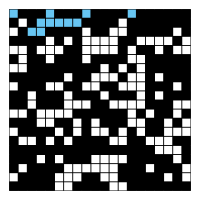

This is my solution to the first assignment of the course. I've implemented *percolation*, *percolation-stats*, and the visualizer in *visualizer.html*. The solution to this problem lies in introducing a 'virtual' top and bottom site, with connections to the top and bottom. The system percolates if the virtual top site is connected to the virtual bottom site.

### Installation
- Run `tsc percolation.ts --out percolation.js` to compile the files.
- `open visualizer.html` to view it in the browser.
- Use the file picker to open one of the input files in `test-data`.

---

# Programming Assignment 1: Percolation
Write a program to estimate the value of the percolation threshold via Monte Carlo simulation.

## Percolation
Given a composite systems comprised of randomly distributed insulating and metallic materials: what fraction of the materials need to be metallic so that the composite system is an electrical conductor? Given a porous landscape with water on the surface (or oil below), under what conditions will the water be able to drain through to the bottom (or the oil to gush through to the surface)? Scientists have defined an abstract process known as percolation to model such situations.

## The Model
We model a percolation system using an n-by-n grid of sites. Each site is either open or blocked. A full site is an open site that can be connected to an open site in the top row via a chain of neighboring (left, right, up, down) open sites. We say the system percolates if there is a full site in the bottom row. In other words, a system percolates if we fill all open sites connected to the top row and that process fills some open site on the bottom row. (For the insulating/metallic materials example, the open sites correspond to metallic materials, so that a system that percolates has a metallic path from top to bottom, with full sites conducting. For the porous substance example, the open sites correspond to empty space through which water might flow, so that a system that percolates lets water fill open sites, flowing from top to bottom.)


## The Problem
In a famous scientific problem, researchers are interested in the following question: if sites are independently set to be open with probability p (and therefore blocked with probability 1 − p), what is the probability that the system percolates? When p equals 0, the system does not percolate; when p equals 1, the system percolates. The plots below show the site vacancy probability p versus the percolation probability for 20-by-20 random grid (left) and 100-by-100 random grid (right).


When n is sufficiently large, there is a threshold value p* such that when p < p* a random n-by-n grid almost never percolates, and when p > p\*, a random n-by-n grid almost always percolates. No mathematical solution for determining the percolation threshold p* has yet been derived. Your task is to write a computer program to estimate p*.

## Percolation data type
To model a percolation system, create a data type Percolation with the following API:
```java
public class Percolation {
   public Percolation(int n)                // create n-by-n grid, with all sites blocked
   public    void open(int row, int col)    // open site (row, col) if it is not open already
   public boolean isOpen(int row, int col)  // is site (row, col) open?
   public boolean isFull(int row, int col)  // is site (row, col) full?
   public     int numberOfOpenSites()       // number of open sites
   public boolean percolates()              // does the system percolate?

   public static void main(String[] args)   // test client (optional)
}
```

### Corner cases
By convention, the row and column indices are integers between 1 and n, where (1, 1) is the upper-left site: Throw a `java.lang.IllegalArgumentException` if any argument to `open()`, `isOpen()`, or `isFull()` is outside its prescribed range. The constructor should throw a `java.lang.IllegalArgumentException` if `n ≤ 0`.

### Performance requirements
The constructor should take time proportional to n2; all methods should take constant time plus a constant number of calls to the union–find methods `union()`, `find()`, `connected()`, and `count()`.

## Monte Carlo simulation
To estimate the percolation threshold, consider the following computational experiment:

- Initialize all sites to be blocked.
- Repeat the following until the system percolates:
  - Choose a site uniformly at random among all blocked sites.
  - Open the site.
- The fraction of sites that are opened when the system percolates provides an estimate of the percolation threshold.

For example, if sites are opened in a 20-by-20 lattice according to the snapshots below, then our estimate of the percolation threshold is 204/400 = 0.51 because the system percolates when the 204th site is opened.



By repeating this computation experiment *T* times and averaging the results, we obtain a more accurate estimate of the percolation threshold. Let *x<sub>t</sub>* be the fraction of open sites in computational experiment *t*. The sample mean $\overline x$ provides an estimate of the percolation threshold; the sample standard deviation *s*; measures the sharpness of the threshold.

$$\overline x  = \frac{x_1 \, + \, x_2 \, + \, \cdots \, + \, x_{T}}{T},
\quad s^2  = \frac{(x_1 - \overline x )^2 \, + \, (x_2 - \overline x )^2 \,+\, \cdots \,+\, (x_{T} - \overline x )^2}{T-1}$$

Assuming *T* is sufficiently large (say, at least 30), the following provides a 95% confidence interval for the percolation threshold:

$$[x  -  \frac{1.96 s} { \sqrt{T} }, \overline x  +  \frac {1.96 s}{\sqrt{T}} ]$$

To perform a series of computational experiments, create a data type PercolationStats with the following API.
```java
public class PercolationStats {
   public PercolationStats(int n, int trials)    // perform trials independent experiments on an n-by-n grid
   public double mean()                          // sample mean of percolation threshold
   public double stddev()                        // sample standard deviation of percolation threshold
   public double confidenceLo()                  // low  endpoint of 95% confidence interval
   public double confidenceHi()                  // high endpoint of 95% confidence interval

   public static void main(String[] args)        // test client (described below)
}
```

The constructor should throw a `java.lang.IllegalArgumentException` if either `n ≤ 0` or `trials ≤ 0`.
Also, include a `main()` method that takes two command-line arguments *n* and *T*, performs *T* independent computational experiments (discussed above) on an *n*-by-*n* grid, and prints the sample mean, sample standard deviation, and the *95% confidence interval* for the percolation threshold. Use `StdRandom` to generate random numbers; use `StdStats` to compute the sample mean and sample standard deviation.

```
% java PercolationStats 200 100
mean                    = 0.5929934999999997
stddev                  = 0.00876990421552567
95% confidence interval = [0.5912745987737567, 0.5947124012262428]

% java PercolationStats 200 100
mean                    = 0.592877
stddev                  = 0.009990523717073799
95% confidence interval = [0.5909188573514536, 0.5948351426485464]

% java PercolationStats 2 10000
mean                    = 0.666925
stddev                  = 0.11776536521033558
95% confidence interval = [0.6646167988418774, 0.6692332011581226]

% java PercolationStats 2 100000
mean                    = 0.6669475
stddev                  = 0.11775205263262094
95% confidence interval = [0.666217665216461, 0.6676773347835391]
```

### Analysis of running time and memory usage (optional and not graded)
Implement the Percolation data type using the quick find algorithm in QuickFindUF.

- Use Stopwatch to measure the total running time of PercolationStats for various values of n and T. How does doubling n affect the total running time? How does doubling T affect the total running time? Give a formula (using tilde notation) of the total running time on your computer (in seconds) as a single function of both n and T.
- Using the 64-bit memory-cost model from lecture, give the total memory usage in bytes (using tilde notation) that a Percolation object uses to model an n-by-n percolation system. Count all memory that is used, including memory for the union–find data structure.
Now, implement the Percolation data type using the weighted quick union algorithm in WeightedQuickUnionUF. Answer the questions in the previous paragraph.

Deliverables. Submit only Percolation.java (using the weighted quick-union algorithm from WeightedQuickUnionUF) and PercolationStats.java. We will supply algs4.jar. Your submission may not call library functions except those in StdIn, StdOut, StdRandom, StdStats, WeightedQuickUnionUF, and java.lang.

For fun. Create your own percolation input file and share it in the discussion forums. For some inspiration, do an image search for "nonogram puzzles solved."

---
**This assignment was developed by Bob Sedgewick and Kevin Wayne. Copyright © 2008.**